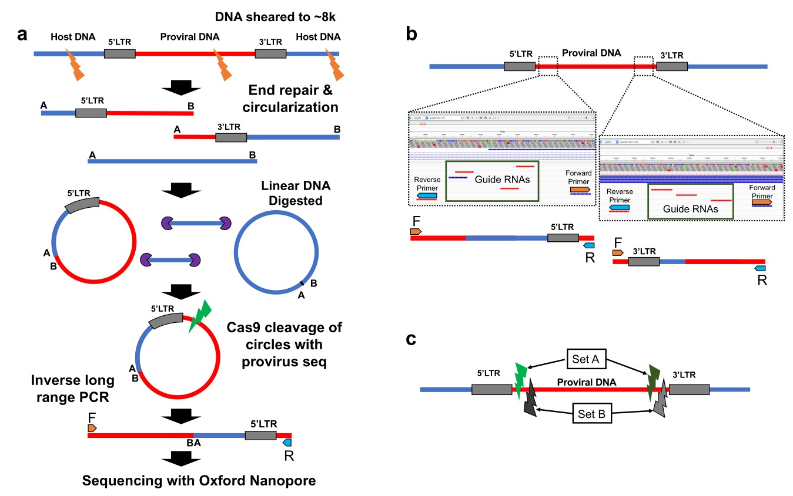

# Pooled CRISPR Inverse PCR sequencing 

Pooled CRISPR Inverse PCR sequencing (PCIP-seq) is a method that leverages selective cleavage of circularized DNA fragments carrying proviral DNA with a pool of CRISPR guide RNAs, followed by inverse long-range PCR and multiplexed sequencing on the Oxford Nanopore MinION platform. A detailled description of the protocol and its applications can be found at [PCIP-seq](https://www.biorxiv.org/content/10.1101/558130v2).

<p align="center">
  
</p>

## SUMMARY: Analysis

**DISCLAIMER:** Given the extreme diversity of proviruses, potential genomic alterations and the noisiness of nanopore sequencing technologies, the following pipeline should not be considered as universal. It can be used to prioritize interesting integration sites (IS) but will have to be adapted to your specific needs. 

* **1.** Basecalling (.fast5 to .fastq).
* **2.** Mapping Reads to the TARGET-HOST Reference.
* **3.** Calling Integration Sites (IS).
* **4.** Calling Integration Sites Specific Variants.

## PREREQUISITES

* albacore (≥ 2.3.1) or guppy (≥ 3.1.5.)
* [porechops (≥ 0.2.4.)](https://github.com/rrwick/Porechop) 
* [samtools (≥ 1.9.)](http://samtools.sourceforge.net/) 
* [minimap2 (≥ 2.10.)](https://github.com/lh3/minimap2) 
* [seqkt (≥ 1.3-r106)](https://github.com/lh3/seqtk)
* [loFreq (≥ 2.1.2.)](http://csb5.github.io/lofreq/) 
* [R ≥3.5.1](https://www.r-project.org/)
  - [Bioconductor (≥ 3.7.)](https://www.bioconductor.org/install/) 
  - [Rsamtools (≥ 1.32.3.)](https://bioconductor.org/packages/release/bioc/html/Rsamtools.html) 
  - [GenomicRanges (≥ 1.32.7.)](https://bioconductor.org/packages/release/bioc/html/GenomicRanges.html)
  - [dplyr (≥ 0.7.8.)](https://cran.r-project.org/web/packages/dplyr/index.html)
  - [ggplot2 (≥ 2.3.1.)](https://cran.r-project.org/web/packages/ggplot2/index.html)
  - [magrittr (≥ 1.5.)](https://cran.r-project.org/web/packages/magrittr/index.html)
  - [purrr (≥ 0.2.5.)](https://cran.r-project.org/web/packages/purrr/index.html)
  - [readr (≥ 1.3.1.)](https://cran.r-project.org/web/packages/readr/index.html)
  - [tibble (≥ 2.0.1.)](https://cran.r-project.org/web/packages/tibble/index.html)
  - [tidyr (≥ 0.8.2.)](https://cran.r-project.org/web/packages/tidyr/index.html)

Code were tested on a Linux fedora 7.2 ('Nitrogen') and macOS 'Mojave'. 

### Genome:

PCIP-Seq pipeline is based on the detection of chimeric TARGET-HOST reads using a chimeric viral-host reference genome. This reference can be created as follows:

```
GENOME="/path/to/TARGETHOST_INDEX/Bos_taurus.UMD3.1.dna.chromosome.fa"
TARGET="/path/to/psp344.fa"

mkdir TARGETHOST_INDEX
cd TARGETHOST_INDEX

cat $GENOME $TARGET > BTA_BLV.fa

TARGETHOST="/path/to/TARGETHOST_INDEX/BTA_BLV.fa"
```

### Variables

- RAW - nanopore data generated as described in [PCIP-seq](https://www.biorxiv.org/content/10.1101/558130v2) in FAST5 format.
- NAME - Sample name.
- TARGETNAME - Name of the TARGET chromosome as the FASTA reference (i.e., HTLV_ATK, HIV_U1, psp344, ...). 
- OUTDIR - Path to the output directory. 
- THREAD - Number of threads.

```
RAW="/path/to/raw.fast5"
NAME="mySample"
TARGETNAME="psp344"
OUTDIR="/path/to/output/mySample"
THREAD=4
LENGTHTARGET=8720 #base-pairs
FASTQ="/path/to/reads.fastq"
```

### Indexing:

Both Minimap2 and LoFreq require an indexed FASTA file:

```
minimap2 -d /path/to/TARGETHOST_INDEX/BTA_BLV.mni $TARGETHOST
samtools faidx $TARGETHOST

TARGETHOSTINDEX="/path/to/TARGETHOST_INDEX/BTA_BLV.mni"
```

## PART 1: BASECALLING

Basecalling has been performed using Guppy in high-accuracy mode.

```
# Basecalling
read_fast5_basecaller.py -f FLO-MIN106 -k SQK-LSK108 --recursive --output_format fastq --input $RAW --save_path /path/to/mySample.fastq -t $THREAD

# Adapter trimming
porechop --discard_middle -i /path/to/mySample.fastq -b /path/to/mySample_trimmed.fastq

FASTQ="/path/to/mySample_trimmed.fastq"
```

## PART 2: MAPPING TO THE REFERENCE

Detection of new integration sites (IS) requires a [Pairwise mApping Format \(PAF\)](https://github.com/lh3/miniasm/blob/master/PAF.md) alignment file produced by minimap2 as input. 

```
minimap2 -cx map-ont -t $THREAD $TARGETHOSTINDEX $FASTQ > "$NAME"_minimap2_TARGETHOST.paf
```

If you want to visualize the alignment results using [Integrated Genome Viewer \(IGV\)](http://software.broadinstitute.org/software/igv/) a [SAM](https://en.wikipedia.org/wiki/SAM_(file_format)) file needs to be created as well.

```
minimap2 -ax map-ont -t $THREAD $TARGETHOSTINDEX $FASTQ > "$NAME"_minimap2_TARGETHOST.sam
samtools view -@ $THREAD -Sb "$NAME"_minimap2_TARGETHOST.sam > "$NAME"_minimap2_TARGETHOST.bam
samtools sort -@ $THREAD "$NAME"_minimap2_TARGETHOST.bam -o "$NAME"_minimap2_TARGETHOST.sorted.bam
samtools index -@ $THREAD "$NAME"_minimap2_TARGETHOST.sorted.bam
```

## PART 3: EXTRACTING INTEGRATION SITES

R functions to extract integration sites and the estimation of the corresponding clone abundances can be downloaded from this repository (PCIP_1.0.tar.gz). After installing R prerequisites, run the following command in your terminal to install PCIP package:

```
R CMD INSTALL PCIP_1.0.tar.gz
```

Integration site detection is performed using the following R functions. A step-by-step explaination of the different functions can be found at [PCIP-R](https://github.com/GIGA-AnimalGenomics-BLV/PCIP/tree/master/RPackage).

Using R, run the following commands:

```
# 0. Load Vackages 
library(PCIP)
library(tidyverse)

# 1. Initialize Variables:
PAF.path = "path/to/"$NAME"_minimap2_TARGETHOST.paf"
targetName = "psp344"
lengthTarget = 8720
mergeISdistance = 200
out.prefix = "path/to/outputs/mySample"

# 2. Read PAF File:
PAF <- readPairwiseAlignmentFile(alignFile = PAF.path)

# 3. Filter The Data To keep Only Chimeric Reads:
# Only the best quality reads are retained here (01, 10, 101, 1001).
PAF.filter <- PCIP_filter(minimap2PAF = PAF, targetName = targetName)

# 4. Get The Read Target-Host Junctions And Shear Sites.
PAF.breakpoints <- PCIP_getBreakPoints(PAF = PAF.filter, lengthTarget = lengthTarget, targetName = targetName)

# 5. Group Target-Host Junctions Into Integration Site Units:
PAF.integrationSite <- PCIP_summarise(PCIPbreakpoints = PAF.breakpoints, align = PAF, targetName = targetName, mergeISdistance = mergeISdistance)

# 6. Save:
write.table(PAF.integrationSite[[1]], paste0(out.prefix, "-insertionSites.txt"), sep = "\t", row.names = F, quote = F)
write.table(PAF.integrationSite[[2]], paste0(out.prefix, "-BEST_splitFASTQ.txt"), sep = "\t", row.names = F, quote = F)
write.table(PAF.integrationSite[[3]], paste0(out.prefix, "-ALL_splitFASTQ.txt"), sep = "\t", row.names = F, quote = F)
```

R PCIP ``PCIP_summarise`` returns a list with three entries:

* **1.** ``-insertionSites.txt``: The integration site position table and estimation of the clone abundances. 
* **2.** ``-BEST_splitFASTQ.txt``: A table reporting the read IDs supporting each IS with an estimated abundance ≥10 reads. Only the best quality reads (01, 01, 101, 1001) are reported in this table.
* **3.** ``-ALL_splitFASTQ.txt``: A table reporting the read IDs supporting each IS. This table is generated by attributing to each IS with an estimated abundance ≥10 reads the IDs of any reads from the ``PAF.path`` file located within ``distance_report`` (i.e., 1000 bp up/downstream). 

The two last tables can be used to extract to extract viral- or host-specific mutations or alterations. 

## PART 4: VIRAL/HOST ALTERATIONS

For each unique IS, extract the target-specific and the host mutations (within +/- 20Kb).

```
# For every unique integration sites (>10 non-PCR duplicated reads)
awk -F'\t' 'NR>1 {print $2}' path/to/mySample-BEST_splitFASTQ.txt | sort | uniq > mySample_uniqueIS.txt

while IFS=$'\t' read -r -a line
do
  ## 1. Create an IS specific folder:
  # ID = chr_start_end
  ID=`echo "${line[0]}" | sed 's/\:/_/g' | sed 's/\-/_/g'`
  mkdir $ID
  cd $ID
  
  ## 2. Extract reads belonging to that particular IS:
  grep -F "${line[0]}" mySample-BEST_splitFASTQ.txt | awk -F'\t' '{print "@"$1}' > "$ID"_readID.txt
  grep -w -A 3 -f "$ID"_readID.txt -F <(gzip -dc $FASTQ) > "$ID".all.fastq
  
  ## 3. To reduce computation time a downsampling of the reads can be performed:
  seqtk sample -s100 "$ID".all.fastq 500 > "$ID".fastq
  
  ## 4. Remap the reads to the target-host reference:
  minimap2 -ax map-ont -t $THREAD $TARGETHOSTINDEX "$ID".fastq > "$ID"_extracted.sam
  samtools view -@ $THREAD -Sb "$ID"_extracted.sam > "$ID"_extracted.bam
  samtools sort -@ $THREAD "$ID"_extracted.bam -o "$ID"_extracted.sorted.bam
  samtools index -@ $THREAD "$ID"_extracted.sorted.bam

  ## 5. Call single-nucleotide polymorphisms:
  
  ### 5.1. Create a .bed file containing the position to call. A 20Kb window is added upstream and downstream:
  win=20000
  IFS=_ read chr start end <<< $ID
  echo -e $chr'\t'`expr $start - $win`'\t'`expr $end + $win` > GENOME.bed
  echo -e $TARGETNAME'\t'1'\t'$LENGTHTARGET > TARGET.bed

  ## 5.2. Variant calling: HOST GENOME
  loFreq call-parallel --pp-threads $THREAD -f $GENOME -l GENOME.bed "$ID"_extracted.sorted.bam > mySample_"$ID"_LoFreq_GENOME.vcf
  
  ## 5.3. Variant calling: TARGET GENOME
  loFreq call-parallel --pp-threads $THREAD -f $TARGET -l TARGET.bed "$ID"_extracted.sorted.bam > mySample_"$ID"_LoFreq_TARGET.vcf
  
  ## 6. Call genomic rearrangements
  # Custom scripts or [NGLMR + Sniffles](https://github.com/fritzsedlazeck/Sniffles) can be used to call genomic rearrangements.

  cd ..
  
done < mySample_uniqueIS.txt

```
